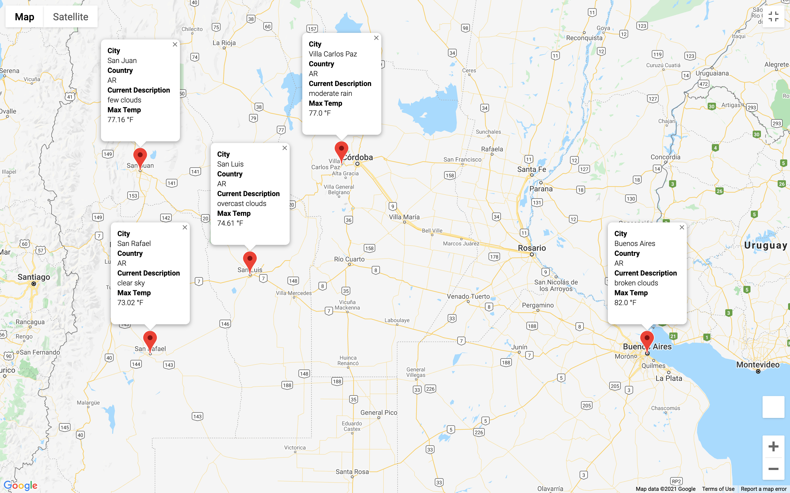
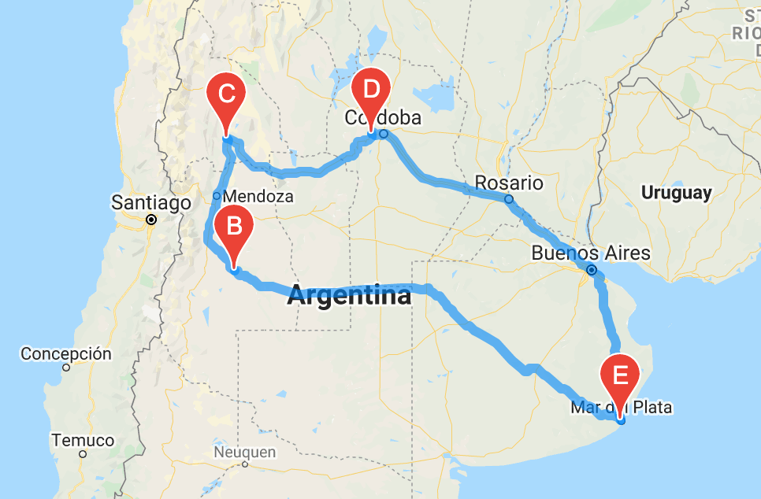

# World_Weather_Analysis
In this module, we were tasked with practicing our analysis, visualization, and statistical skills by retrieving and analyzing weather data for the company, PlanMyTrip. We utilized Python, decision and repitition statements, data structures, Pandas, Matplotlib, and SciPy statistics.

## Overview of the Analysis

The task at hand can be separated into three assignments(Deliverables 1, 2, and 3):

Deliverable 1: Retrieve Weather Data

Deliverable 2: Create a Customer Travel Destinations Map

Deliverable 3: Create a Travel Itinerary Map

## Results

We have put together a trip in Argentina, focusing on a vacation with a minimum of 75 degrees and a maximum of 90 degrees.

## Summary
Altogether, we were able to map out a round-about route for the perfect Argentina vacation.
